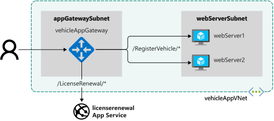

# Application Gateway

## Create web sites

```bash
az account list-locations -o table

RG=<resource group name>
az group create --name $RG --location <Azure region>
```

Create a virtual network called `vehicleappvnet` with a subnet called `webServerSubnet`

```bash
az network vnet create \
  --resource-group $RG \
  --name vehicleAppVnet \
  --address-prefix 10.0.0.0/16 \
  --subnet-name webServerSubnet \
  --subnet-prefix 10.0.1.0/24
```

Configure two virtual machines

```bash
git clone https://github.com/MicrosoftDocs/mslearn-load-balance-web-traffic-with-application-gateway module-files

az vm create \
  --resource-group $RG \
  --name webServer1 \
  --image UbuntuLTS \
  --admin-username azureuser \
  --generate-ssh-keys \
  --vnet-name vehicleAppVnet \
  --subnet webServerSubnet \
  --public-ip-address "" \
  --nsg "" \
  --custom-data module-files/scripts/vmconfig.sh \
  --no-wait
  
az vm create \
  --resource-group $RG \
  --name webServer2 \
  --image UbuntuLTS \
  --admin-username azureuser \
  --generate-ssh-keys \
  --vnet-name vehicleAppVnet \
  --subnet webServerSubnet \
  --public-ip-address "" \
  --nsg "" \
  --custom-data module-files/scripts/vmconfig.sh
```

Verify with

```bash
az vm list \
  --resource-group $RG \
  --show-details \
  --output table
```

## Create App Service and deploy demo site

Generate a unique name for the site

```bash
APPSERVICE="licenserenewal$RANDOM"
```

Create the App Service plan

```bash
az appservice plan create \
    --resource-group $RG \
    --name vehicleAppServicePlan \
    --sku S1
```

Create the web app and deploy

```bash
az webapp create \
    --resource-group $RG \
    --name $APPSERVICE \
    --plan vehicleAppServicePlan \
    --deployment-source-url https://github.com/MicrosoftDocs/mslearn-load-balance-web-traffic-with-application-gateway \
    --deployment-source-branch appService --runtime "DOTNETCORE|2.1"
```



## Configure the network for Application Gateway

Create the private subnet required by Application Gateway

```bash
az network vnet subnet create \
  --resource-group $RG \
  --vnet-name vehicleAppVnet  \
  --name appGatewaySubnet \
  --address-prefixes 10.0.0.0/24
```

Create a public IP address and DNS label for Application Gateway

```bash
az network public-ip create \
  --resource-group $RG \
  --name appGatewayPublicIp \
  --sku Standard \
  --dns-name vehicleapp${RANDOM}
```

## Create an application gateway

Create an application gateway called `vehicleAppGateway`

```bash
az network application-gateway create \
--resource-group $RG \
--name vehicleAppGateway \
--sku WAF_v2 \
--capacity 2 \
--vnet-name vehicleAppVnet \
--subnet appGatewaySubnet \
--public-ip-address appGatewayPublicIp \
--http-settings-protocol Http \
--http-settings-port 8080 \
--private-ip-address 10.0.0.4 \
--frontend-port 8080
```

Retrieve private IP addresses of the web servers

```bash
az vm list-ip-addresses \
  --resource-group $RG \
  --name webServer1 \
  --query [0].virtualMachine.network.privateIpAddresses[0] \
  --output tsv
  
az vm list-ip-addresses \
  --resource-group $RG \
  --name webserver2 \
  --query [0].virtualMachine.network.privateIpAddresses[0] \
  --output tsv
```

Add the back-end pools for each web site

```bash
az network application-gateway address-pool create \
  --gateway-name vehicleAppGateway \
  --resource-group $RG \
  --name vmPool \
  --servers 10.0.1.4 10.0.1.5
  
az network application-gateway address-pool create \
    --resource-group $RG \
    --gateway-name vehicleAppGateway \
    --name appServicePool \
    --servers $APPSERVICE.azurewebsites.net
```

Create a front-end port 80

```bash
az network application-gateway frontend-port create \
    --resource-group $RG \
    --gateway-name vehicleAppGateway \
    --name port80 \
    --port 80
```

Create a listener to handle the requests

```bash
az network application-gateway http-listener create \
    --resource-group $RG \
    --name vehicleListener \
    --frontend-port port80 \
    --frontend-ip appGatewayFrontendIP \
    --gateway-name vehicleAppGateway
```

## Add a health probe 

```bash
az network application-gateway probe create \
    --resource-group $RG \
    --gateway-name vehicleAppGateway \
    --name customProbe \
    --path / \
    --interval 15 \
    --threshold 3 \
    --timeout 10 \
    --protocol Http \
    --host-name-from-http-settings true
    
az network application-gateway http-settings create \
    --resource-group $RG \
    --gateway-name vehicleAppGateway \
    --name appGatewayBackendHttpSettings \
    --host-name-from-backend-pool true \
    --port 80 \
    --probe customProbe
```

## Configure path-based routing

Create a path map for `vmPool`

```bash
az network application-gateway url-path-map create \
    --resource-group $RG \
    --gateway-name vehicleAppGateway \
    --name urlPathMap \
    --paths /VehicleRegistration/* \
    --http-settings appGatewayBackendHttpSettings \
    --address-pool vmPool


```

Create a path map for `appServicePool`

```bash
az network application-gateway url-path-map rule create \
    --resource-group $RG \
    --gateway-name vehicleAppGateway \
    --name appServiceUrlPathMap \
    --paths /LicenseRenewal/* \
    --http-settings appGatewayBackendHttpSettings \
    --address-pool appServicePool \
    --path-map-name urlPathMap
```

Create a new routing rule for the created path map

```bash
az network application-gateway rule create \
    --resource-group $RG \
    --gateway-name vehicleAppGateway \
    --name appServiceRule \
    --http-listener vehicleListener \
    --rule-type PathBasedRouting \
    --address-pool appServicePool \
    --url-path-map urlPathMap
```

Remove the default rule as no longer required

```bash
az network application-gateway rule delete \
    --resource-group $RG \
    --gateway-name vehicleAppGateway \
    --name rule1
```

## Test load balancing for the vehicle registration web app

Generate the root URL

```bash
echo http://$(az network public-ip show \
  --resource-group $RG \
  --name appGatewayPublicIp \
  --query dnsSettings.fqdn \
  --output tsv)
```

```bash
az vm deallocate \
  --resource-group $RG \
  --name webServer1
  
az vm start \
  --resource-group $RG \
  --name webServer1
```

