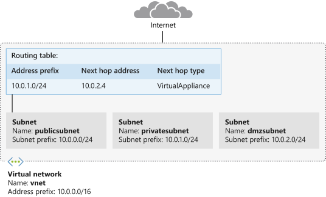

# Custom Routes



## Create a route table and custom route

Create a route table

```bash
az network route-table create \
        --name publictable \
        --resource-group learn-a9ecaf40-ca34-428b-81e6-b823e6fd9d97 \
        --disable-bgp-route-propagation false
```

Create a custom route

```bash
az network route-table route create \
        --route-table-name publictable \
        --resource-group learn-a9ecaf40-ca34-428b-81e6-b823e6fd9d97 \
        --name productionsubnet \
        --address-prefix 10.0.1.0/24 \
        --next-hop-type VirtualAppliance \
        --next-hop-ip-address 10.0.2.4
```

## Create a virtual network and subnets

Create a virtual network called `vnet` and a subnet called `publicsubnet`

```bash
az network vnet create \
        --name vnet \
        --resource-group learn-a9ecaf40-ca34-428b-81e6-b823e6fd9d97 \
        --address-prefix 10.0.0.0/16 \
        --subnet-name publicsubnet \
        --subnet-prefix 10.0.0.0/24
```

Create a `privatesubnet` subnet

```bash
az network vnet subnet create \
        --name privatesubnet \
        --vnet-name vnet \
        --resource-group learn-a9ecaf40-ca34-428b-81e6-b823e6fd9d97 \
        --address-prefix 10.0.1.0/24
```

Create a `dmzsubnet` subnet

```bash
az network vnet subnet create \
        --name dmzsubnet \
        --vnet-name vnet \
        --resource-group learn-a9ecaf40-ca34-428b-81e6-b823e6fd9d97 \
        --address-prefix 10.0.2.0/24
```

Verify the three subnets with

```bash
az network vnet subnet list \
        --resource-group learn-a9ecaf40-ca34-428b-81e6-b823e6fd9d97 \
        --vnet-name vnet \
        --output table
```

## Associate the route table with the public subnet

```bash
az network vnet subnet update \
        --name publicsubnet \
        --vnet-name vnet \
        --resource-group learn-a9ecaf40-ca34-428b-81e6-b823e6fd9d97 \
        --route-table publictable
```

## Deploy the network virtual appliance

```bash
az vm create \
    --resource-group learn-a9ecaf40-ca34-428b-81e6-b823e6fd9d97 \
    --name nva \
    --vnet-name vnet \
    --subnet dmzsubnet \
    --image UbuntuLTS \
    --admin-username azureuser \
    --admin-password <password>
```

## Enable IP forwarding for the Azure network interface

Obtain the IP of the NVA network interface 

```bash
NICID=$(az vm nic list \
    --resource-group learn-a9ecaf40-ca34-428b-81e6-b823e6fd9d97 \
    --vm-name nva \
    --query "[].{id:id}" --output tsv)

echo $NICID
```

Obtain the name of the NVA network interface

```bash
NICNAME=$(az vm nic show \
    --resource-group learn-a9ecaf40-ca34-428b-81e6-b823e6fd9d97 \
    --vm-name nva \
    --nic $NICID \
    --query "{name:name}" --output tsv)

echo $NICNAME
```

Enable IP forwarding for the network interface

```bash
az network nic update --name $NICNAME \
    --resource-group learn-a9ecaf40-ca34-428b-81e6-b823e6fd9d97 \
    --ip-forwarding true
```

## Enable IP forwarding in the appliance

Save the public Ip address of the NVA appliance

```bash
NVAIP="$(az vm list-ip-addresses \
    --resource-group learn-a9ecaf40-ca34-428b-81e6-b823e6fd9d97 \
    --name nva \
    --query "[].virtualMachine.network.publicIpAddresses[*].ipAddress" \
    --output tsv)"

echo $NVAIP
```

Enable IP forwarding with the NVA

```bash
ssh -t -o StrictHostKeyChecking=no azureuser@$NVAIP 'sudo sysctl -w net.ipv4.ip_forward=1; exit;'
```

## Create public and private virtual machines

```bash
code cloud-init.txt

#cloud-config
package_upgrade: true
packages:
   - inetutils-traceroute
```

Create the public virtual machine

```bash
az vm create \
    --resource-group learn-a9ecaf40-ca34-428b-81e6-b823e6fd9d97 \
    --name public \
    --vnet-name vnet \
    --subnet publicsubnet \
    --image UbuntuLTS \
    --admin-username azureuser \
    --no-wait \
    --custom-data cloud-init.txt \
    --admin-password <password>
```

Create the private virtual machine

```bash
az vm create \
    --resource-group learn-a9ecaf40-ca34-428b-81e6-b823e6fd9d97 \
    --name private \
    --vnet-name vnet \
    --subnet privatesubnet \
    --image UbuntuLTS \
    --admin-username azureuser \
    --no-wait \
    --custom-data cloud-init.txt \
    --admin-password <password>
```

Run a Linux `watch` command to check the machines are running

```bash
watch -d -n 5 "az vm list \
    --resource-group learn-a9ecaf40-ca34-428b-81e6-b823e6fd9d97 \
    --show-details \
    --query '[*].{Name:name, ProvisioningState:provisioningState, PowerState:powerState}' \
    --output table"
```

Save the public IP address of the public virtual machine

```bash
PUBLICIP="$(az vm list-ip-addresses \
    --resource-group learn-a9ecaf40-ca34-428b-81e6-b823e6fd9d97 \
    --name public \
    --query "[].virtualMachine.network.publicIpAddresses[*].ipAddress" \
    --output tsv)"

echo $PUBLICIP
```

Save the public IP address of the private virtual machine

```bash
PRIVATEIP="$(az vm list-ip-addresses \
    --resource-group learn-a9ecaf40-ca34-428b-81e6-b823e6fd9d97 \
    --name private \
    --query "[].virtualMachine.network.publicIpAddresses[*].ipAddress" \
    --output tsv)"

echo $PRIVATEIP
```

## Test traffic routing through the network virtual appliance

Trace the route from public to private

```bash
ssh -t -o StrictHostKeyChecking=no azureuser@$PUBLICIP 'traceroute private --type=icmp; exit'
```

Trace the route from private to public

```shell
ssh -t -o StrictHostKeyChecking=no azureuser@$PRIVATEIP 'traceroute public --type=icmp; exit'
```

Check for traffic going directly to public and not through the NVA

```bash
ssh -t -o StrictHostKeyChecking=no azureuser@$PRIVATEIP 'traceroute public --type=icmp; exit'
```

