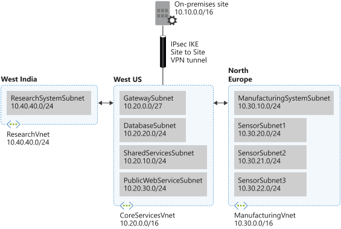

# Implement IP addressing for Azure virtual networks

## Network Design



## CoreServicesVnet

### Create the CoreServicesVnet virtual network

```shell
az network vnet create \
    --resource-group learn-d08447d1-f14a-4acb-880b-7b641928d0ac \
    --name CoreServicesVnet \
    --address-prefix 10.20.0.0/16 \
    --location westus
```

### Create the subnets within the above virtual network
```shell
az network vnet subnet create \
    --resource-group learn-d08447d1-f14a-4acb-880b-7b641928d0ac \
    --vnet-name CoreServicesVnet \
    --name GatewaySubnet \
    --address-prefixes 10.20.0.0/27

az network vnet subnet create \
    --resource-group learn-d08447d1-f14a-4acb-880b-7b641928d0ac \
    --vnet-name CoreServicesVnet \
    --name SharedServicesSubnet \
    --address-prefixes 10.20.10.0/24

az network vnet subnet create \
    --resource-group learn-d08447d1-f14a-4acb-880b-7b641928d0ac \
    --vnet-name CoreServicesVnet \
    --name DatabaseSubnet \
    --address-prefixes 10.20.20.0/24

az network vnet subnet create \
    --resource-group learn-d08447d1-f14a-4acb-880b-7b641928d0ac \
    --vnet-name CoreServicesVnet \
    --name PublicWebServiceSubnet \
    --address-prefixes 10.20.30.0/24
```

### Review 
```shell
az network vnet subnet list \
    --resource-group learn-d08447d1-f14a-4acb-880b-7b641928d0ac \
    --vnet-name CoreServicesVnet \
    --output table
```

## ManufacturingVnet

### Create the ManufacturingVnet virtual network

```shell
az network vnet create \
    --resource-group learn-d08447d1-f14a-4acb-880b-7b641928d0ac \
    --name ManufacturingVnet \
    --address-prefix 10.30.0.0/16 \
    --location northeurope
```

### Create the subnets within the above virtual network

```shell
az network vnet subnet create \
    --resource-group learn-d08447d1-f14a-4acb-880b-7b641928d0ac \
    --vnet-name ManufacturingVnet \
    --name ManufacturingSystemSubnet \
    --address-prefixes 10.30.10.0/24

az network vnet subnet create \
    --resource-group learn-d08447d1-f14a-4acb-880b-7b641928d0ac \
    --vnet-name ManufacturingVnet \
    --name SensorSubnet1 \
    --address-prefixes 10.30.20.0/24

az network vnet subnet create \
    --resource-group learn-d08447d1-f14a-4acb-880b-7b641928d0ac \
    --vnet-name ManufacturingVnet \
    --name SensorSubnet2 \
    --address-prefixes 10.30.21.0/24

az network vnet subnet create \
    --resource-group learn-d08447d1-f14a-4acb-880b-7b641928d0ac \
    --vnet-name ManufacturingVnet \
    --name SensorSubnet3 \
    --address-prefixes 10.30.22.0/24
```

### Review

```shell
az network vnet subnet list \
    --resource-group learn-d08447d1-f14a-4acb-880b-7b641928d0ac \
    --vnet-name ManufacturingVnet \
    --output tables
```

## ResearchVnet

### Create the ResearchVnet virtual network

```shell
az network vnet create \
    --resource-group learn-d08447d1-f14a-4acb-880b-7b641928d0ac \
    --name ResearchVnet \
    --address-prefix 10.40.40.0/24 \
    --location westindia
```

### Create the subnets within the above virtual network

```shell
az network vnet subnet create \
    --resource-group learn-d08447d1-f14a-4acb-880b-7b641928d0ac \
    --vnet-name ResearchVnet \
    --name ResearchSystemSubnet \
    --address-prefixes 10.40.40.0/24
```

### Review

```shell
az network vnet subnet list \
    --resource-group learn-d08447d1-f14a-4acb-880b-7b641928d0ac \
    --vnet-name ResearchVnet \
    --output table
```

