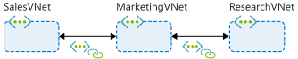

# Network Peering

*Configure virtual network peering connections (hub and spoke topology) by using Azure CLI commands*



MarketingVNet is configured as the hub, with SalesVNet and ResearchVNet as spokes.

## Create Connections

Create a peering connection between `SalesVNet` and `MarketingVNet`.  This command also permits virtual network access cross the connection

```shell
az network vnet peering create \
    --name SalesVNet-To-MarketingVNet \
    --remote-vnet MarketingVNet \
    --resource-group learn-a8b10028-a377-4c1d-8e57-dd4fc9e74c67 \
    --vnet-name SalesVNet \
    --allow-vnet-access
```

Create a reciprocal connection from `MarketingVNet` to `SalesVNet`.

```shell
az network vnet peering create \
    --name MarketingVNet-To-SalesVNet \
    --remote-vnet SalesVNet \
    --resource-group learn-a8b10028-a377-4c1d-8e57-dd4fc9e74c67 \
    --vnet-name MarketingVNet \
    --allow-vnet-access
```

Create a peering connection between `MarketingVNet` and `ResearchVNet`

```shell
az network vnet peering create \
    --name MarketingVNet-To-ResearchVNet \
    --remote-vnet ResearchVNet \
    --resource-group learn-a8b10028-a377-4c1d-8e57-dd4fc9e74c67 \
    --vnet-name MarketingVNet \
    --allow-vnet-access
```

Create a reciprocal connection between `ResearchVNet` and `MarketingVNet`

## Check Connections

*Ensure the `PeeringState`* returns as `Connected`

Check the connection between `SalesVNet` and `MarketingVNet`

```shell
az network vnet peering list \
    --resource-group learn-a8b10028-a377-4c1d-8e57-dd4fc9e74c67 \
    --vnet-name ResearchVNet \
    --output table
```

Check the peering connection between the `ResearchVNet` and `MarketingVNet` virtual networks

```shell
az network vnet peering list \
    --resource-group learn-a8b10028-a377-4c1d-8e57-dd4fc9e74c67 \
    --vnet-name ResearchVNet \
    --output table
```

Check the peering connections for the `MarketingVNet` virtual network

```shell
az network vnet peering list \
    --resource-group learn-a8b10028-a377-4c1d-8e57-dd4fc9e74c67 \
    --vnet-name MarketingVNet \
    --output table
```

## Check Effective Routes

Show routes that apply to the `SalesVM` network interface

```shell
az network nic show-effective-route-table \
    --resource-group learn-a8b10028-a377-4c1d-8e57-dd4fc9e74c67 \
    --name SalesVMVMNic \
    --output table
    
Source    State    Address Prefix    Next Hop Type    Next Hop IP
--------  -------  ----------------  ---------------  -------------
Default   Active   10.1.0.0/16       VnetLocal
Default   Active   10.2.0.0/16       VNetPeering
Default   Active   0.0.0.0/0         Internet
Default   Active   10.0.0.0/8        None
Default   Active   100.64.0.0/10     None
Default   Active   192.168.0.0/16    None
```

Show routes for `Marketing VM`

```shell
az network nic show-effective-route-table \
    --resource-group learn-a8b10028-a377-4c1d-8e57-dd4fc9e74c67 \
    --name MarketingVMVMNic \
    --output table
```

Show routes for `Research VM`

```shell
az network nic show-effective-route-table \
    --resource-group learn-a8b10028-a377-4c1d-8e57-dd4fc9e74c67 \
    --name ResearchVMVMNic \
    --output table
```

## Test with SSH

Retrieve list of the IP addresses

```shell
az vm list \
    --resource-group learn-a8b10028-a377-4c1d-8e57-dd4fc9e74c67 \
    --query "[*].{Name:name, PrivateIP:privateIps, PublicIP:publicIps}" \
    --show-details \
    --output table
```

```bash
ssh -o StrictHostKeyChecking=no azureuser@<SalesVM public IP>
```

