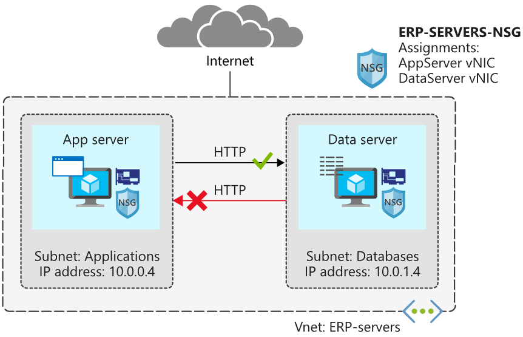

# Network Security Groups




Locate the resource group

```shell
az account list-locations -o table
```

Create the resource group

```shell
rg=<resource group name>

    az group create --name $rg --location <location>
```

Create `ERP-servers` virtual network and an `Applications` subnet

```shell
az network vnet create \
    --resource-group $rg \
    --name ERP-servers \
    --address-prefix 10.0.0.0/16 \
    --subnet-name Applications \
    --subnet-prefix 10.0.0.0/24
```

Create a `Databases` subnet

```shell
az network vnet subnet create \
    --resource-group $rg \
    --vnet-name ERP-servers \
    --address-prefix 10.0.1.0/24 \
    --name Databases
```

Create a `ERP-SERVERS-NSG` network security group

```shell
az network nsg create \
    --resource-group $rg \
    --name ERP-SERVERS-NSG
```

## Create VMs

Create VMs running Ubuntu

```shell
wget -N https://raw.githubusercontent.com/MicrosoftDocs/mslearn-secure-and-isolate-with-nsg-and-service-endpoints/master/cloud-init.yml && \
az vm create \
    --resource-group $rg \
    --name AppServer \
    --vnet-name ERP-servers \
    --subnet Applications \
    --nsg ERP-SERVERS-NSG \
    --image UbuntuLTS \
    --size Standard_DS1_v2 \
    --admin-username azureuser \
    --custom-data cloud-init.yml \
    --no-wait \
    --admin-password <password>

az vm create \
    --resource-group $rg \
    --name DataServer \
    --vnet-name ERP-servers \
    --subnet Databases \
    --nsg ERP-SERVERS-NSG \
    --size Standard_DS1_v2 \
    --image UbuntuLTS \
    --admin-username azureuser \
    --custom-data cloud-init.yml \
    --admin-password <password>
```

Confirm the VMs are running

```shell
az vm list \
    --resource-group $rg \
    --show-details \
    --query "[*].{Name:name, Provisioned:provisioningState, Power:powerState}" \
    --output table
    
Name        Provisioned    Power
----------  -------------  ----------
AppServer   Succeeded      VM running
DataServer  Succeeded      VM running
```

## Check Connectivity

List the public IP addresses

```shell
az vm list \
    --resource-group $rg \
    --show-details \
    --query "[*].{Name:name, PrivateIP:privateIps, PublicIP:publicIps}" \
    --output table
```

Store the IPs in variables

```shell
APPSERVERIP="$(az vm list-ip-addresses \
                 --resource-group $rg \
                 --name AppServer \
                 --query "[].virtualMachine.network.publicIpAddresses[*].ipAddress" \
                 --output tsv)"

DATASERVERIP="$(az vm list-ip-addresses \
                 --resource-group $rg \
                 --name DataServer \
                 --query "[].virtualMachine.network.publicIpAddresses[*].ipAddress" \
                 --output tsv)"
```

Check whether you can connect.  Note, should timeout

```shell
ssh azureuser@$APPSERVERIP -o ConnectTimeout=5
ssh azureuser@$DATASERVERIP -o ConnectTimeout=5
```

## Allow SSH

Create a new inbound rule to enable SSH

```shell
az network nsg rule create \
    --resource-group $rg \
    --nsg-name ERP-SERVERS-NSG \
    --name AllowSSHRule \
    --direction Inbound \
    --priority 100 \
    --source-address-prefixes '*' \
    --source-port-ranges '*' \
    --destination-address-prefixes '*' \
    --destination-port-ranges 22 \
    --access Allow \
    --protocol Tcp \
    --description "Allow inbound SSH"
```

## Prevent web access with a security rule

Add a rule to allow `AppServer` to communicate with `DataServer` over HTTP but prevent a reciprocal connection.

```shell
az network nsg rule create \
    --resource-group $rg \
    --nsg-name ERP-SERVERS-NSG \
    --name httpRule \
    --direction Inbound \
    --priority 150 \
    --source-address-prefixes 10.0.1.4 \
    --source-port-ranges '*' \
    --destination-address-prefixes 10.0.0.4 \
    --destination-port-ranges 80 \
    --access Deny \
    --protocol Tcp \
    --description "Deny from DataServer to AppServer on port 80"
```

Test connectivity

```shell
ssh -t azureuser@$APPSERVERIP 'wget http://10.0.1.4; exit; bash'

200 OK

ssh -t azureuser@$DATASERVERIP 'wget http://10.0.0.4; exit; bash'

Connection timed out
```

## Configure an app security group

Create an app security group for database servers.

```shell
az network asg create \
    --resource-group $rg \
    --name ERP-DB-SERVERS-ASG
```

Associate `DataServer` with the app security group

```shell
az network nic ip-config update \
    --resource-group $rg \
    --application-security-groups ERP-DB-SERVERS-ASG \
    --name ipconfigDataServer \
    --nic-name DataServerVMNic \
    --vnet-name ERP-servers \
    --subnet Databases
```

Update the HTTP rule in the `ERP-SERVERS-NSG` network security group

```shell
az network nsg rule update \
    --resource-group $rg \
    --nsg-name ERP-SERVERS-NSG \
    --name httpRule \
    --direction Inbound \
    --priority 150 \
    --source-address-prefixes "" \
    --source-port-ranges '*' \
    --source-asgs ERP-DB-SERVERS-ASG \
    --destination-address-prefixes 10.0.0.4 \
    --destination-port-ranges 80 \
    --access Deny \
    --protocol Tcp \
    --description "Deny from DataServer to AppServer on port 80 using application security group"
```

Test the updated rule

```shell
ssh -t azureuser@$APPSERVERIP 'wget http://10.0.1.4; exit; bash'

200 OK

ssh -t azureuser@$DATASERVERIP 'wget http://10.0.0.4; exit; bash'

Connection timed out
```

