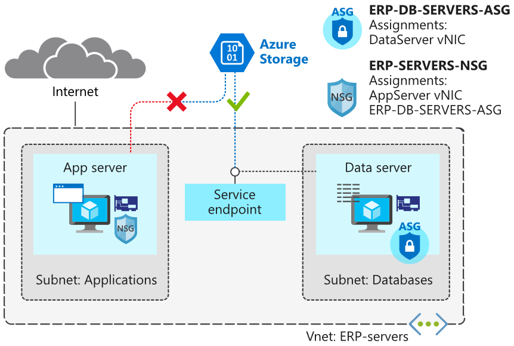

# Service Endpoints

Create a service endpoint and use network rules to restrict access to Azure storage



## Add rules to the network security group

Create an outbound rule to allow access to storage

```shell
az network nsg rule create \
    --resource-group $rg \
    --nsg-name ERP-SERVERS-NSG \
    --name Allow_Storage \
    --priority 190 \
    --direction Outbound \
    --source-address-prefixes "VirtualNetwork" \
    --source-port-ranges '*' \
    --destination-address-prefixes "Storage" \
    --destination-port-ranges '*' \
    --access Allow \
    --protocol '*' \
    --description "Allow access to Azure Storage"
```

Create an outbound rule to deny all internet access

```shell
az network nsg rule create \
    --resource-group $rg \
    --nsg-name ERP-SERVERS-NSG \
    --name Deny_Internet \
    --priority 200 \
    --direction Outbound \
    --source-address-prefixes "VirtualNetwork" \
    --source-port-ranges '*' \
    --destination-address-prefixes "Internet" \
    --destination-port-ranges '*' \
    --access Deny \
    --protocol '*' \
    --description "Deny access to Internet."
```

## Configure storage account and file share

Create a storage account

```shell
STORAGEACCT=$(az storage account create \
                --resource-group $rg \
                --name engineeringdocs$RANDOM \
                --sku Standard_LRS \
                --query "name" | tr -d '"')
```

Store primary key for above storage in a variable

```shell
STORAGEKEY=$(az storage account keys list \
                --resource-group $rg \
                --account-name $STORAGEACCT \
                --query "[0].value" | tr -d '"')
```

Create an Azure file share

```shell
az storage share create \
    --account-name $STORAGEACCT \
    --account-key $STORAGEKEY \
    --name "erp-data-share"
```

## Enable the service endpoint

Assign `Microsoft.Storage` endpoint to the subnet

```shell
az network vnet subnet update \
    --vnet-name ERP-servers \
    --resource-group $rg \
    --name Databases \
    --service-endpoints Microsoft.Storage
```

Deny all access

```shell
az storage account update \
    --resource-group $rg \
    --name $STORAGEACCT \
    --default-action Deny
```

Restrict access to the storage account. This should only allow traffic from the `Databases` subnet

```shell
az storage account network-rule add \
    --resource-group $rg \
    --account-name $STORAGEACCT \
    --vnet ERP-servers \
    --subnet Databases
```

## Test access to storage resources

```bash
APPSERVERIP="$(az vm list-ip-addresses \
                    --resource-group $rg \
                    --name AppServer \
                    --query "[].virtualMachine.network.publicIpAddresses[*].ipAddress" \
                    --output tsv)"

DATASERVERIP="$(az vm list-ip-addresses \
                    --resource-group $rg \
                    --name DataServer \
                    --query "[].virtualMachine.network.publicIpAddresses[*].ipAddress" \
                    --output tsv)"
```

Connect to `AppServer` and `DataServer` VMs and attempt to mount the file share

```bash
ssh -t azureuser@$APPSERVERIP \
    "mkdir azureshare; \
    sudo mount -t cifs //$STORAGEACCT.file.core.windows.net/erp-data-share azureshare \
    -o vers=3.0,username=$STORAGEACCT,password=$STORAGEKEY,dir_mode=0777,file_mode=0777,sec=ntlmssp; findmnt \
    -t cifs; exit; bash"
    
mount error

ssh -t azureuser@$DATASERVERIP \
    "mkdir azureshare; \
    sudo mount -t cifs //$STORAGEACCT.file.core.windows.net/erp-data-share azureshare \
    -o vers=3.0,username=$STORAGEACCT,password=$STORAGEKEY,dir_mode=0777,file_mode=0777,sec=ntlmssp;findmnt \
    -t cifs; exit; bash"
    
mount successful
```

