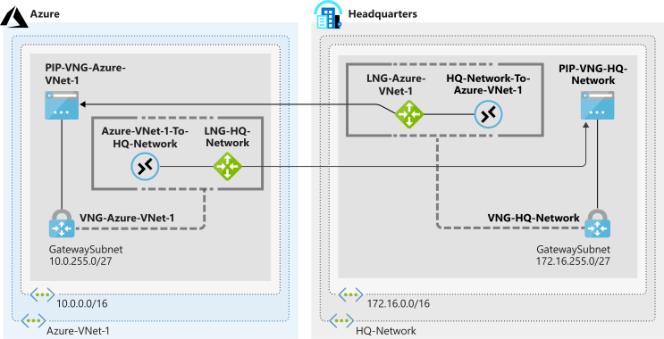

# Prepare Azure and on-premises virtual networks by using Azure CLI commands



## Create the Azure resources

Create the `Azure-VNet-1` virtual network with a `Services` subnet

```bash
az network vnet create \
    --resource-group learn-4bf2dd4e-feaa-476c-8440-d148887b1585 \
    --name Azure-VNet-1 \
    --address-prefix 10.0.0.0/16 \
    --subnet-name Services \
    --subnet-prefix 10.0.0.0/24
```

Add a `GatewaySubnet` to the `Azure-VNet-1` virtual network

```bash
az network vnet subnet create \
    --resource-group learn-4bf2dd4e-feaa-476c-8440-d148887b1585 \
    --vnet-name Azure-VNet-1 \
    --address-prefix 10.0.255.0/27 \
    --name GatewaySubnet
```

Create the `LNG-HQ-Network` local network gateway 

```bash
az network local-gateway create \
    --resource-group learn-4bf2dd4e-feaa-476c-8440-d148887b1585 \
    --gateway-ip-address 94.0.252.160 \
    --name LNG-HQ-Network \
    --local-address-prefixes 172.16.0.0/16
```

## Create the simulates on-premises network and supporting resources

Create the `HQ-Network` and an `Applications` subnet

```bash
az network vnet create \
    --resource-group learn-4bf2dd4e-feaa-476c-8440-d148887b1585 \
    --name HQ-Network \
    --address-prefix 172.16.0.0/16 \
    --subnet-name Applications \
    --subnet-prefix 172.16.0.0/24
```

Add `GatewaySubnet` to `HQ-Network`

```bash
az network vnet subnet create \
    --resource-group learn-4bf2dd4e-feaa-476c-8440-d148887b1585 \
    --address-prefix 172.16.255.0/27 \
    --name GatewaySubnet \
    --vnet-name HQ-Network
```

Create an `LNG-Azure-VNet-1` local network gateway

```bash
az network local-gateway create \
    --resource-group learn-4bf2dd4e-feaa-476c-8440-d148887b1585 \
    --gateway-ip-address 94.0.252.160 \
    --name LNG-Azure-VNet-1 \
    --local-address-prefixes 172.16.255.0/27
```

## Verify the topology

Confirm the virtual networks have been successfully created

```bash
az network vnet list --output table
```

Confirm the local network gateways have been successfully created

```bash
az network local-gateway list \
    --resource-group learn-4bf2dd4e-feaa-476c-8440-d148887b1585 \
    --output table
```

## Create the Azure-side VPN gateway

Create the `PIP-VNG-Azure-VNet-1` public IP address

```bash
az network public-ip create \
    --resource-group learn-4bf2dd4e-feaa-476c-8440-d148887b1585 \
    --name PIP-VNG-Azure-VNet-1 \
    --allocation-method Dynamic
```

Create the `VNG-Azure-VNet-1` virtual network

```bash
az network vnet create \
    --resource-group learn-4bf2dd4e-feaa-476c-8440-d148887b1585 \
    --name VNG-Azure-VNet-1 \
    --subnet-name GatewaySubnet
```

Create the `VNG-Azure-VNet-1` virtual network gateway

```bash
az network vnet-gateway create \
    --resource-group learn-4bf2dd4e-feaa-476c-8440-d148887b1585 \
    --name VNG-Azure-VNet-1 \
    --public-ip-address PIP-VNG-Azure-VNet-1 \
    --vnet VNG-Azure-VNet-1 \
    --gateway-type Vpn \
    --vpn-type RouteBased \
    --sku VpnGw1 \
    --no-wait
```

## Create the on-premises VPN gateway

Create the `PIP-VNG-HQ-Network` public IP address

```bash
az network public-ip create \
    --resource-group learn-4bf2dd4e-feaa-476c-8440-d148887b1585 \
    --name PIP-VNG-HQ-Network \
    --allocation-method Dynamic
```

Create the `VNG-HQ-Network` virtual network

```bash
az network vnet create \
    --resource-group learn-4bf2dd4e-feaa-476c-8440-d148887b1585 \
    --name VNG-HQ-Network \
    --subnet-name GatewaySubnet
```

Create the `VNG-HQ-Network` virtual network gateway

```bash
az network vnet-gateway create \
    --resource-group learn-4bf2dd4e-feaa-476c-8440-d148887b1585 \
    --name VNG-HQ-Network \
    --public-ip-address PIP-VNG-HQ-Network \
    --vnet VNG-HQ-Network \
    --gateway-type Vpn \
    --vpn-type RouteBased \
    --sku VpnGw1 \
    --no-wait
```

Gateway creation takes approximately 45 minutes to complete. To monitor the progress of the gateway creation, run the following command. We're using the Linux `watch` command to run the `az network vnet-gateway list` command periodically, which enables you to monitor the progress

```bash
watch -d -n 5 az network vnet-gateway list \
    --resource-group learn-4bf2dd4e-feaa-476c-8440-d148887b1585 \
    --output table
```

After each VPN gateway shows a `ProvisioningState` of `Succeeded`, you're ready to continue

## Update the local network gateway IP references

Check both virtual network gateways have been created

```bash
az network vnet-gateway list \
    --resource-group learn-4bf2dd4e-feaa-476c-8440-d148887b1585 \
    --query "[?provisioningState=='Succeeded']" \
    --output table
```

Retrieve the IPv4 address assigned to `PIP-VNG-Azure-VNet-1` and store it in a variable

```bash
PIPVNGAZUREVNET1=$(az network public-ip show \
    --resource-group learn-4bf2dd4e-feaa-476c-8440-d148887b1585 \
    --name PIP-VNG-Azure-VNet-1 \
    --query "[ipAddress]" \
    --output tsv)
```

Update the `LNG-Azure-VNet-1` local network gateways so that it points to the public IP address attached to the `VNG-Azure-VNet-1` virtual network gateway

```bash
az network local-gateway update \
    --resource-group learn-4bf2dd4e-feaa-476c-8440-d148887b1585 \
    --name LNG-Azure-VNet-1 \
    --gateway-ip-address $PIPVNGAZUREVNET1
```

Retrieve the IPv4 address assigned to `PIP-VNG-HQ-Network` and store it in a variable

```bash
PIPVNGHQNETWORK=$(az network public-ip show \
    --resource-group learn-4bf2dd4e-feaa-476c-8440-d148887b1585 \
    --name PIP-VNG-HQ-Network \
    --query "[ipAddress]" \
    --output tsv)
```

Update the `LNG-HQ-Network` local network gateway so that it points to the public IP address attached to the `VNG-HQ-Network` virtual network gateway

```bash
az network local-gateway update \
    --resource-group learn-4bf2dd4e-feaa-476c-8440-d148887b1585 \
    --name LNG-HQ-Network \
    --gateway-ip-address $PIPVNGHQNETWORK
```

## Create the connections

Create a shared key to use for the connections.  This should be a string of printable ASCII characters, no longer than 128 characters.

```bash
SHAREDKEY=<shared key>
```

Create a connection from `VNG-Azure-VNet-1` to `LNG-HQ-Network`

```bash
az network vpn-connection create \
    --resource-group learn-4bf2dd4e-feaa-476c-8440-d148887b1585 \
    --name Azure-VNet-1-To-HQ-Network \
    --vnet-gateway1 VNG-Azure-VNet-1 \
    --shared-key $SHAREDKEY \
    --local-gateway2 LNG-HQ-Network
```

*`LNG-HQ-Network` contains a reference to the IP address on the simulated on-premised VPN device*

 Create a connection from `VNG-HQ-Network` to `LNG-Azure-VNet-1`

```bash
az network vpn-connection create \
    --resource-group learn-4bf2dd4e-feaa-476c-8440-d148887b1585 \
    --name HQ-Network-To-Azure-VNet-1  \
    --vnet-gateway1 VNG-HQ-Network \
    --shared-key $SHAREDKEY \
    --local-gateway2 LNG-Azure-VNet-1
```

*`LNG-Azure-VNet-1`* contains a reference to the public IP address associated with the `VNG-Azure-VNet-1` VPN gateway

The tunnels should automatically connect and become active.

## Verification

Confirm that the `Azure-VNet-1-To-HQ-Network` is connected

```bash
az network vpn-connection show \
    --resource-group learn-4bf2dd4e-feaa-476c-8440-d148887b1585 \
    --name Azure-VNet-1-To-HQ-Network  \
    --output table \
    --query '{Name:name,ConnectionStatus:connectionStatus}'
```

