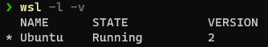

# Windows Subsystem for Linux

## Versions

Basically, use version 2.  This [feature comparison](https://docs.microsoft.com/en-us/windows/wsl/compare-versions) will explain why.  Here's how to [install and update](https://docs.microsoft.com/en-us/windows/wsl/install-win10).

Determining which version you have isn't intuitive.  If `wsl -l -v` fails to provide a list of versions then you are likely on version 1.  The command will only output the following if version 2 has been installed:



When upgrading to version 2, you may have to uninstall and reinstall as per these [instructions](https://www.digitalocean.com/community/posts/trying-the-new-wsl-2-its-fast-windows-subsystem-for-linux).

## WSL Commands

List installed distributions

```shell
wsl --list --all
```

List installed distributions with version

```shell
wsl --list --v
```

Upgrade a distribution

```shell
wsl --upgrade Ubuntu
```

## Linux Commands

You really shouldn't be running an out of date OS, so make sure to patch Ubuntu regularly with

```bash
sudo apt-get update && sudo apt-get upgrade
```

Navigate to home folder and open explorer

```bash
cd ~

explorer.exe .
```

## References

- [Ruby on Rails on Windows is not just possible, it's fabulous using WSL2 and VS Code](https://www.hanselman.com/blog/ruby-on-rails-on-windows-is-not-just-possible-its-fabulous-using-wsl2-and-vs-code)
- [Command Reference for Windows Subsystem for Linux](https://docs.microsoft.com/en-us/windows/wsl/reference)
